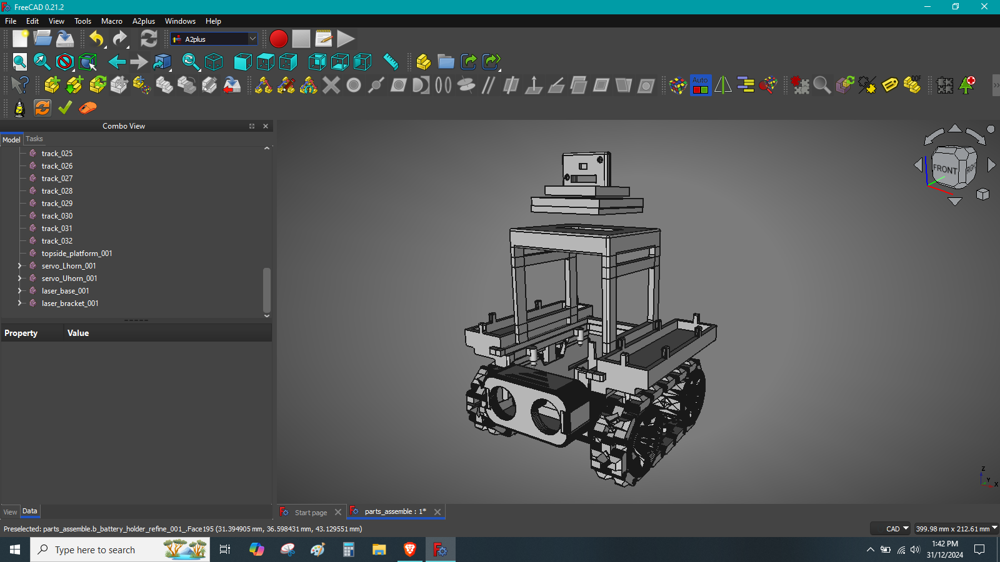
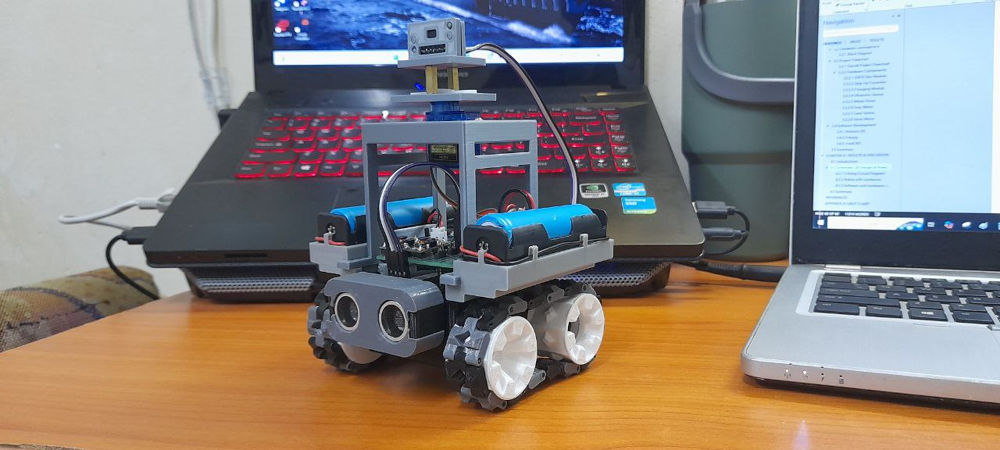

# 🤖 Autonomous Mobile Robot Platform

## 📌 Overview
This project focuses on the development of an **autonomous mobile robot** capable of obstacle avoidance using sensors and microcontroller-based control.

The robot is designed with:
- User-friendly battery access
- Compact 3D-printed structure
- Autonomous navigation capability

## 🎯 Objectives
- Design a compact robot with easy battery access
- Develop movement control algorithm
- Implement obstacle avoidance system

## ⚙️ Hardware Components
- ESP32 Microcontroller
- Ultrasonic Sensor (HC-SR04)
- Laser Sensor (VL53L0X)
- Servo Motor
- MX1508 Motor Driver
- N20 Gear Motors
- 18650 Li-ion Batteries
- TP4056 Charging Module

## 🧠 System Architecture
- Sensors detect obstacles (distance measurement)
- ESP32 processes input
- Motor driver controls movement
- Servo rotates laser sensor for scanning

## 🔄 Robot Behavior
1. Move forward by default
2. Detect obstacle using sensors
3. Stop when obstacle is too close
4. Scan left and right using servo
5. Move towards direction with more space

## 📊 Results
- Ultrasonic sensor loses accuracy at longer distances
- Laser sensor provides more stable readings
- Robot successfully performs obstacle avoidance

## 🛠️ Software Used
- Arduino IDE
- FreeCAD
- Fritzing

## 📸 Project Images

## 📄 License

This project is for academic and educational purposes.

## 👨‍💻 Author
Muhammad Syahmi Bin Mohd Shukri 

Bachelor of Electronic Engineering Technology
